# Twitter-like Service Design Notes

## 1. Functional Requirements

1. User Registration and Authentication
    - Account creation (username, email, password)
    - Secure credential storage
    - User authentication
    - Session management

2. Tweeting
    - Post tweets (280 character limit)
    - Support for text, hashtags, user mentions, media attachments
    - Character limit enforcement
    - Efficient storage and retrieval of tweets

3. Follow/Unfollow
    - Allow users to follow/unfollow other users
    - Maintain a follow graph
    - Update user relationships

4. Timeline
    - Display chronological feed of tweets from followed users
    - Generate and serve personalized timelines
    - Support real-time updates

5. Searching
    - Search for tweets and users (keywords, hashtags, usernames)
    - Provide relevant and accurate results
    - Efficient indexing and storage for fast, scalable searching

6. Retweeting and Liking
    - Allow users to retweet (share others' tweets)
    - Handle retweets efficiently (maintain original metadata and attribution)
    - Enable users to like tweets

7. Direct Messaging
    - Support private communication between users
    - Send and receive direct messages
    - Ensure privacy and security (access controls, encryption)

## 2. Non-functional Requirements

### Scalability
- Handle large number of users and tweets
- Horizontal scalability through server addition
- Independent scaling of individual components

### Availability
- High availability with minimal downtime
- Redundancy at server, database, and geo levels
- Handle failures without significant user impact

### Reliability
- Ensure data integrity and consistency
- Prevent data loss (backups, replication)
- Balance consistency models for accuracy and performance

### Latency
- Real-time updates and fast response times
- Minimize latency for critical operations
- Use caching, CDNs, and efficient data retrieval

## 3. Data Model

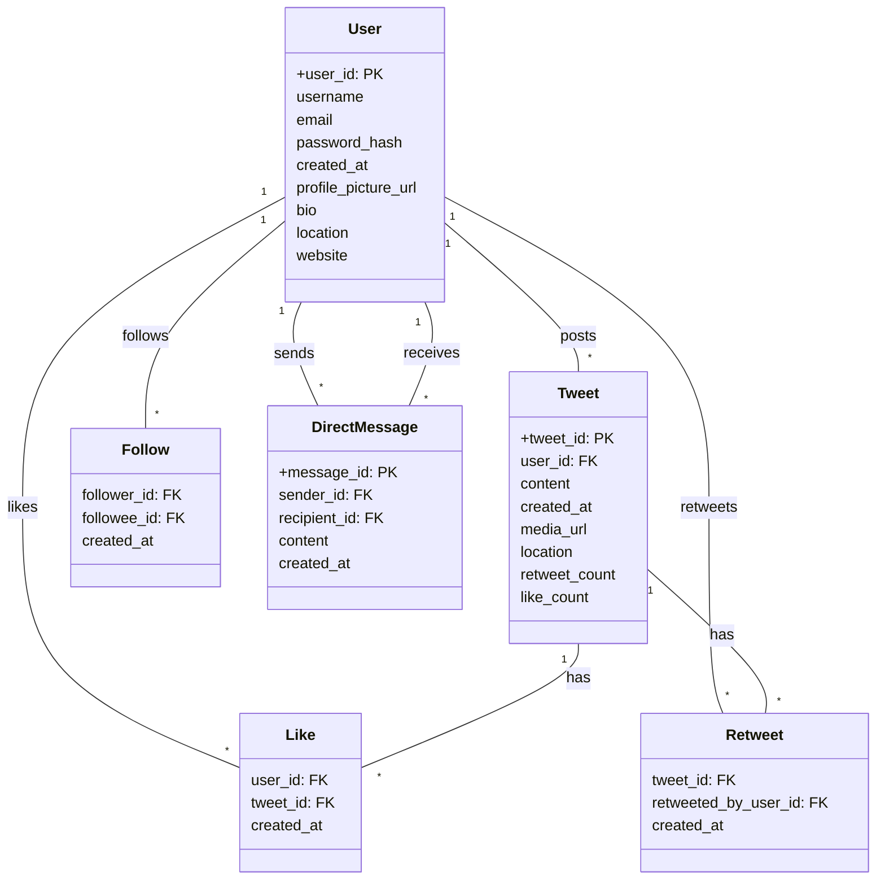

### Key Entities:
1. User
    - Attributes: user_id (PK), username, email, password_hash, created_at, profile_picture_url, bio, location, website

2. Tweet
    - Attributes: tweet_id (PK), user_id (FK), content, created_at, media_url, location, retweet_count, like_count

3. Follow
    - Attributes: follower_id (FK), followee_id (FK), created_at

4. Like
    - Attributes: user_id (FK), tweet_id (FK), created_at

5. Retweet
    - Attributes: tweet_id (FK), retweeted_by_user_id (FK), created_at

6. DirectMessage
    - Attributes: message_id (PK), sender_id (FK), recipient_id (FK), content, created_at

### Relationships:
- User posts many Tweets (1:*)
- User follows many Users (M:N)
- User likes many Tweets (M:N)
- User retweets many Tweets (M:N)
- User sends and receives many DirectMessages (1:*)

### Design Considerations:
- Efficient storage and retrieval of data
- Support for common queries and operations
- Scalability to handle large volumes of data
- Flexibility to accommodate future feature additions

# Twitter-like Service Design Notes

## 4. Scale Calculations

### Assumptions
- Total users: 100 million
- Daily active users: 20 million
- Tweets per user per day: 5
- Average tweet size: 200 bytes
- Average media size: 1 MB
- Tweets with media: 20%
- Tweet retention: 5 years

## 4. Scale Calculations

### Storage Requirements

1. Tweet Storage
    - Daily: 20 million users × 5 tweets/user/day × 200 bytes/tweet = 20 GB
    - Yearly: 20 GB/day × 365 days = 7.3 TB
    - 5 years: 7.3 TB/year × 5 years = 36.5 TB

2. Media Storage
    - Daily: 20 million users × 5 tweets/user/day × 20% media tweets × 1 MB/media = 200 TB
    - Yearly: 200 TB/day × 365 days = 73 PB
    - 5 years: 73 PB/year × 5 years = 365 PB

3. User Storage
    - Assuming 1 MB storage per user (profile picture, bio, etc.)
    - Total: 100 million users × 1 MB/user = 100 TB

Total Storage (5 years): 36.5 TB (tweets) + 365 PB (media) + 100 TB (users) ≈ 365 PB

### Bandwidth Considerations

1. Tweet Delivery
    - Assuming an average of 100 followers per user
    - Daily deliveries: 20 million users × 5 tweets/user/day × 100 followers/user = 10 billion
    - Daily bandwidth: 10 billion tweet deliveries/day × 200 bytes/tweet = 2 TB

2. Media Delivery
    - Daily deliveries: 20 million users × 5 tweets/user/day × 20% media tweets × 100 followers/user = 2 billion
    - Daily bandwidth: 2 billion media deliveries/day × 1 MB/media = 2 PB

Total Daily Bandwidth: 2 TB (tweets) + 2 PB (media) ≈ 2 PB

### Processing Requirements
- Peak tweets/second: 1,200
- Peak media uploads/second: 240
- Fanout requests/second: 120,000

### Cache Sizing
- Daily tweet views: 2 billion
- Estimated cache size: 320 GB

## 5. High-Level Design

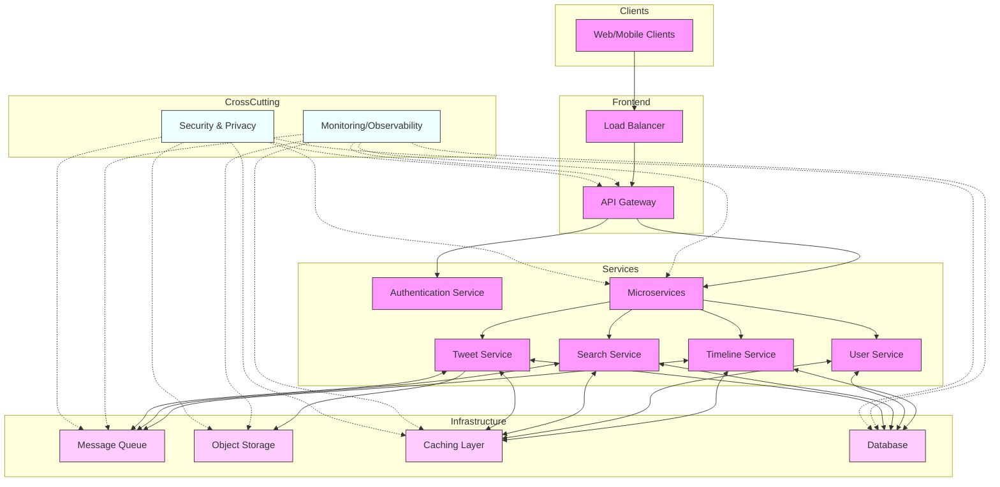

Our Twitter-like service employs a microservices architecture to ensure scalability, modularity, and maintainability. The system is designed to handle millions of users, tweets, and interactions efficiently. Here's a detailed breakdown of the key components:

### 5.1 Client Layer
- **Web/Mobile Clients**: End-user interfaces for accessing the service.

### 5.2 Frontend Layer
1. **Load Balancer**
    - Distributes incoming traffic across multiple server instances.
    - Ensures high availability and optimal resource utilization.
    - Can use algorithms like round-robin, least connections, or IP hash for request distribution.

2. **API Gateway**
    - Acts as the single entry point for all client requests.
    - Handles cross-cutting concerns such as:
        - Request routing
        - Authentication and authorization
        - Rate limiting and throttling
        - Request/response transformation
    - Provides a unified interface for clients, abstracting the underlying microservices architecture.

### 5.3 Service Layer
1. **Authentication Service**
    - Manages user authentication and session handling.
    - Implements secure protocols like OAuth for user authentication.
    - Generates and validates authentication tokens.

2. **Microservices**
   a. **Tweet Service**
    - Handles tweet creation, retrieval, and deletion.
    - Stores tweet metadata in the database.
    - Manages media uploads to object storage.
    - Publishes new tweets to the message queue for further processing.

   b. **User Service**
    - Manages user registration and profile information.
    - Handles follow/unfollow functionality.
    - Maintains user relationships and preferences.

   c. **Timeline Service**
    - Generates and serves personalized user timelines.
    - Consumes new tweets from the message queue to update timelines in real-time.
    - Implements efficient algorithms for timeline generation and caching.

   d. **Search Service**
    - Enables full-text search for tweets and users.
    - Indexes tweet and user data for efficient querying.
    - Implements relevance ranking algorithms for search results.

### 5.4 Infrastructure Layer
1. **Message Queue (e.g., Apache Kafka)**
    - Enables asynchronous communication between microservices.
    - Ensures reliable message delivery and processing.
    - Supports event-driven architecture and decouples services.

2. **Object Storage (e.g., Amazon S3)**
    - Stores and serves media files (images, videos) associated with tweets.
    - Provides scalable and durable storage for large files.

3. **Caching Layer (e.g., Redis)**
    - Stores frequently accessed data to reduce database load and improve response times.
    - Caches user profiles, popular tweets, and timeline data.

4. **Database (e.g., Apache Cassandra or Amazon DynamoDB)**
    - Stores structured data such as user information, tweets, follows, and likes.
    - Designed for high write throughput and low-latency reads.
    - Implements sharding and replication for scalability and availability.

### 5.5 Cross-Cutting Concerns
1. **Monitoring/Observability**
    - Implements comprehensive logging and metrics collection.
    - Uses tools like Prometheus and Grafana for monitoring system health and performance.
    - Enables quick identification and resolution of issues.

2. **Security & Privacy**
    - Implements end-to-end encryption for data in transit and at rest.
    - Enforces access controls and data protection measures.
    - Ensures compliance with data privacy regulations.

This high-level design provides a scalable and robust architecture for our Twitter-like service. The microservices approach allows for independent scaling and development of different components, while the supporting infrastructure ensures high performance and reliability. The cross-cutting concerns of monitoring and security are applied throughout the system to maintain operational excellence and protect user data.

# Tweet Service Design Document

## 1. Introduction
The Tweet Service is a core component of our Twitter-like platform, responsible for handling the creation, retrieval, and deletion of tweets. This document outlines the detailed design of the Tweet Service, including its architecture, API endpoints, data models, and key flows.

## 2. High-Level Architecture

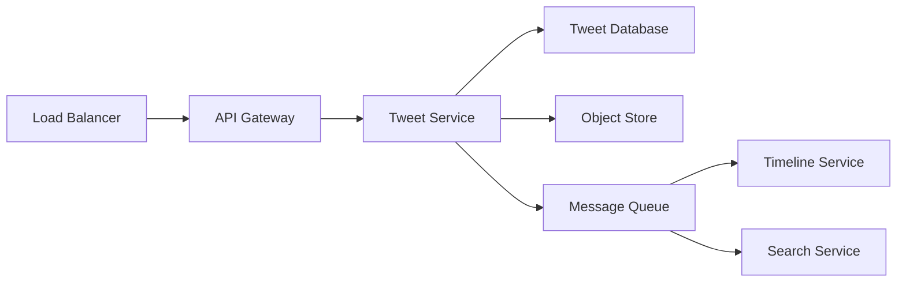

The Tweet Service interacts with several components:
- Receives requests through the API Gateway
- Stores tweet data in the Tweet Database
- Stores media files in the Object Store
- Publishes events to the Message Queue for other services to consume

## 3. API Endpoints

### 3.1 Create Tweet
- **Endpoint**: POST /tweets
- **Request Body**:
  ```json
  {
    "content": "string",
    "userId": "string",
    "media": "binary" (optional)
  }
  ```
- **Response**:
  ```json
  {
    "tweetId": "string",
    "content": "string",
    "userId": "string",
    "createdAt": "timestamp",
    "mediaUrl": "string" (optional)
  }
  ```

### 3.2 Retrieve Tweet
- **Endpoint**: GET /tweets/{tweetId}
- **Response**:
  ```json
  {
    "tweetId": "string",
    "content": "string",
    "userId": "string",
    "createdAt": "timestamp",
    "mediaUrl": "string" (optional),
    "likeCount": "integer",
    "retweetCount": "integer"
  }
  ```

### 3.3 Delete Tweet
- **Endpoint**: DELETE /tweets/{tweetId}
- **Headers**: Authorization token
- **Response**:
  ```json
  {
    "status": "success/error",
    "message": "string"
  }
  ```

### 3.4 Retrieve User Tweets
- **Endpoint**: GET /users/{userId}/tweets
- **Query Parameters**:
    - page: integer
    - pageSize: integer
- **Response**:
  ```json
  {
    "tweets": [
      {
        "tweetId": "string",
        "content": "string",
        "createdAt": "timestamp",
        "mediaUrl": "string" (optional)
      }
    ],
    "nextPage": "integer" (optional)
  }
  ```

## 4. Data Models

### 4.1 Tweet Database Schema
```
Table: Tweets
- tweetId: string (Partition Key)
- userId: string
- content: string
- createdAt: timestamp (Clustering Key)
- mediaUrl: string (optional)
- likeCount: integer
- retweetCount: integer
```

### 4.2 Object Storage
- Media files stored with a unique identifier
- Filename format: `{userId}_{timestamp}_{originalFileName}`

## 5. Tweet Creation Flow

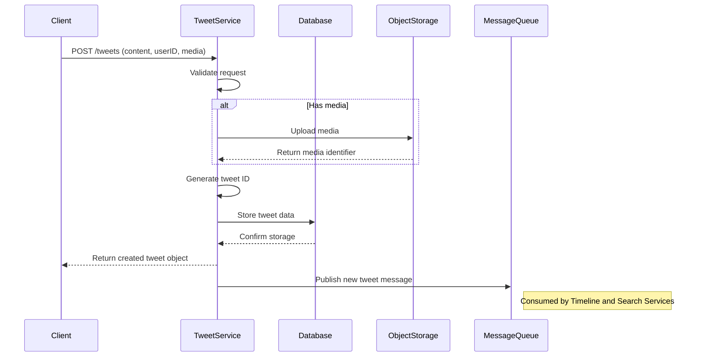

1. Client sends POST request to /tweets endpoint
2. Tweet Service validates the request:
    - Check tweet length (e.g., ≤ 280 characters)
    - Verify user authentication
    - Validate media file type and size (if present)
3. If media is present:
    - Generate a unique filename
    - Upload to Object Storage
    - Receive and store the media URL
4. Generate a unique tweet ID (e.g., using UUID)
5. Store tweet data in the Database
6. Return the created tweet object to the client
7. Publish a message to the Message Queue:
   ```json
   {
     "eventType": "NEW_TWEET",
     "tweetId": "string",
     "userId": "string",
     "timestamp": "timestamp"
   }
   ```

## 6. Scaling Considerations

### 6.1 Database Sharding
- Shard the Tweets table based on tweetId or userId
- Implement a sharding strategy to distribute data evenly

## 10. Caching Strategies

Implementing effective caching is crucial for improving the performance and scalability of the Tweet Service. This section outlines various caching strategies, eviction policies, and implementation considerations.

### 10.1 Caching Strategies

#### 10.1.1 Time-based Sliding Window Cache
- **Description**: Maintain a cache of tweets posted within the last N hours.
- **Implementation**:
    - Set a time window (e.g., 24 hours)
    - When a new tweet is created, add it to the cache
    - Periodically remove tweets older than the time window
- **Pros**: Ensures the newest tweets are always available in the cache
- **Cons**: May cache less popular tweets unnecessarily

#### 10.1.2 Popularity-based Caching
- **Description**: Cache tweets based on engagement metrics.
- **Implementation**:
    - Define an engagement score: `score = (likes * 1) + (retweets * 2) + (replies * 1.5)`
    - Set a threshold score (e.g., 100)
    - Cache tweets with scores above the threshold
    - Recalculate scores periodically (e.g., hourly) and update the cache
- **Pros**: Ensures high-engagement tweets are readily available
- **Cons**: May miss newly popular tweets until the next score calculation

#### 10.1.3 Hybrid Approach
- **Description**: Combine time-based and popularity-based strategies.
- **Implementation**:
    - Cache all tweets from the last 2 hours regardless of popularity
    - For older tweets, only cache those meeting a popularity threshold
    - Adjust time window and popularity threshold based on system capacity
- **Pros**: Balances recency and popularity
- **Cons**: More complex to implement and tune

#### 10.1.4 Predictive Caching
- **Description**: Use machine learning to predict and cache potentially popular tweets.
- **Implementation**:
    - Develop a ML model trained on historical tweet data
    - Features could include user follower count, tweet content, time of day, etc.
    - Predict engagement score for new tweets
    - Cache tweets with high predicted scores
- **Pros**: Can proactively cache tweets before they become popular
- **Cons**: Requires maintaining and updating a ML model

#### 10.1.5 User-based Caching
- **Description**: Cache tweets from popular or verified users.
- **Implementation**:
    - Define criteria for "popular" users (e.g., >100k followers or verified status)
    - Cache recent tweets (e.g., last 50) from these users
- **Pros**: Simple to implement, likely to cache tweets that will be requested often
- **Cons**: May miss popular tweets from less-followed users

### 10.2 Eviction Strategies

#### 10.2.1 Least Recently Used (LRU)
- **Description**: Evict the least recently accessed tweets when the cache is full.
- **Implementation**:
    - Maintain a linked list of cached tweets, ordered by access time
    - When a tweet is accessed, move it to the front of the list
    - When cache is full, evict from the end of the list
- **Pros**: Adapts well to changing access patterns
- **Cons**: Doesn't consider frequency of access

#### 10.2.2 Time to Live (TTL)
- **Description**: Assign an expiration time to each cached tweet.
- **Implementation**:
    - Set TTL when adding a tweet to cache (e.g., 2 hours for regular tweets, 24 hours for viral tweets)
    - Periodically scan and remove expired tweets
    - Optionally, extend TTL on cache hits
- **Pros**: Ensures cache freshness, easy to implement
- **Cons**: May evict still-popular tweets if TTL is too short

#### 10.2.3 Least Frequently Used (LFU)
- **Description**: Evict the least frequently accessed tweets.
- **Implementation**:
    - Maintain a counter for each cached tweet
    - Increment counter on each access
    - When cache is full, evict tweet with lowest counter
    - Optionally, implement a decay factor to favor recent popularity
- **Pros**: Keeps frequently accessed tweets in cache
- **Cons**: May retain old, once-popular tweets too long

#### 10.2.4 Size-based Eviction
- **Description**: Evict based on cache size limits.
- **Implementation**:
    - Set a maximum cache size (e.g., 10 GB)
    - Track total size of cached tweets
    - When limit is reached, evict tweets until size is under limit
    - Combine with other strategies (e.g., evict largest AND least recently used)
- **Pros**: Prevents cache from exceeding memory limits
- **Cons**: May evict popular tweets if they're large (e.g., with media)

### 10.3 Implementation Considerations

1. **Multi-tiered Caching**:
    - Implement hot, warm, and cold caches
    - Example:
        - Hot cache: In-memory, for extremely popular tweets (last 1 hour, >1000 engagements)
        - Warm cache: Redis, for moderately popular tweets (last 24 hours, >100 engagements)
        - Cold storage: Database, for all other tweets

2. **Cache Warming**:
    - Implement a cache warming process on system startup
    - Example: On startup, load the top 1000 tweets from the last 24 hours into the cache

3. **Cache Invalidation**:
    - Use cache versioning or generation numbers
    - Example: Attach a version number to each cached tweet. Increment on updates. Check version before serving from cache.

4. **Separate Caches**:
    - Use distinct caches for different data types
    - Example:
        - Tweet content cache
        - User profile cache
        - Timeline cache

5. **Monitoring and Analytics**:
    - Implement comprehensive monitoring
    - Metrics to track:
        - Cache hit rate
        - Cache miss rate
        - Eviction rate
        - Average cache latency
    - Use these metrics to continuously refine caching strategies

6. **Consistency Considerations**:
    - Implement cache update/invalidation mechanisms for when tweets are edited or deleted
    - Consider using eventual consistency model for less critical updates

7. **Distributed Caching**:
    - Use a distributed caching system (e.g., Redis Cluster) for horizontal scalability
    - Implement consistent hashing for cache key distribution

8. **Fallback Mechanism**:
    - Implement a fallback to database if cache fails or is unavailable
    - Use circuit breaker pattern to prevent cascading failures

By implementing these caching strategies and considering these implementation details, the Tweet Service can significantly improve its performance, reduce database load, and provide a responsive user experience even under high load conditions.

### 6.3 Read Replicas
- Set up read replicas of the Tweet Database to handle high read traffic

## 7. Security Considerations

- Implement rate limiting on API endpoints to prevent abuse
- Use OAuth 2.0 for user authentication
- Encrypt sensitive data in transit and at rest
- Implement input validation to prevent injection attacks

## 8. Monitoring and Logging

- Log all API requests and responses
- Monitor key metrics:
    - Request latency
    - Error rates
    - Database query performance
    - Object Storage upload/download times
- Set up alerts for abnormal patterns or performance issues

## 9. Future Improvements

- Implement content moderation for tweets
- Add support for tweet threads
- Introduce tweet analytics (e.g., impression count, engagement rate)
- Optimize media storage and delivery (e.g., image resizing, video transcoding)

## 11. Tweet Retrieval Flow

The tweet retrieval flow is a critical process in the Tweet Service, handling requests to view specific tweets or a user's tweet timeline. This section details the step-by-step process and considerations for efficient tweet retrieval.

### 11.1 Flow Diagram

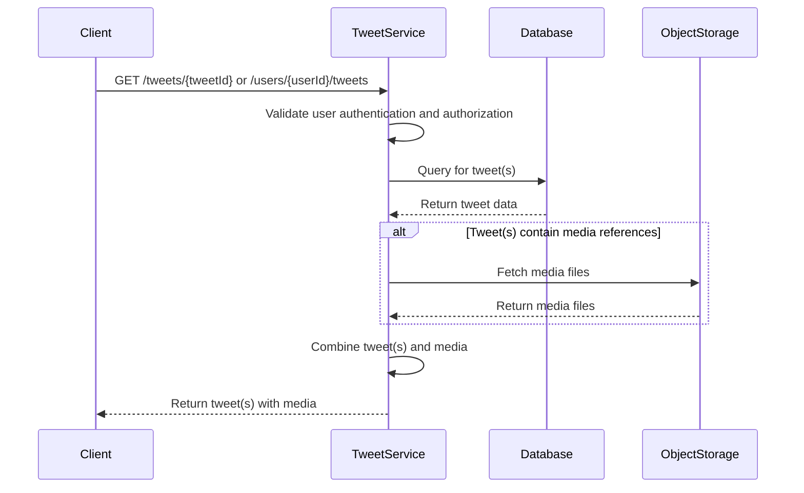

### 11.2 Detailed Process

1. **Client Request**
    - The client sends a GET request to one of two endpoints:
        - `/tweets/{tweetId}` for a specific tweet
        - `/users/{userId}/tweets` for a user's tweet timeline
    - Parameters:
        - For specific tweet: `tweetId` in the URL
        - For user timeline: `userId` in the URL, optional pagination parameters

2. **Authentication and Authorization**
    - Tweet Service validates the user's authentication token
    - Checks if the user has permission to view the requested tweet(s)
    - Considerations:
        - Implement OAuth 2.0 for secure authentication
        - Use role-based access control (RBAC) for authorization

3. **Database Query**
    - Tweet Service constructs a query based on the request type:
        - For specific tweet: `SELECT * FROM tweets WHERE tweet_id = ?`
        - For user timeline: `SELECT * FROM tweets WHERE user_id = ? ORDER BY created_at DESC LIMIT ? OFFSET ?`
    - Executes the query against the database
    - Considerations:
        - Use prepared statements to prevent SQL injection
        - Implement database indexing on `tweet_id` and `user_id` for faster queries
        - Consider implementing read replicas for high-traffic scenarios

4. **Media Retrieval (if applicable)**
    - If the retrieved tweet(s) contain media references:
        - Extract media identifiers from the tweet data
        - Construct media retrieval requests for the object storage
        - Fetch media files in parallel to optimize retrieval time
    - Considerations:
        - Implement batching for multiple media files to reduce network calls
        - Use async I/O operations to prevent blocking

5. **Data Combination**
    - Combine the tweet data from the database with the retrieved media files
    - Format the response according to the API specification
    - Considerations:
        - Implement efficient data structures for combining tweets and media
        - Consider using worker threads for parallel processing of multiple tweets

6. **Response to Client**
    - Return the formatted tweet(s) with media to the client
    - Include metadata such as pagination info for user timelines
    - Considerations:
        - Implement response compression to reduce bandwidth usage
        - Use ETags for caching to reduce unnecessary data transfer

### 11.3 Optimization Strategies

1. **Caching**
    - Implement a multi-level caching strategy:
        - L1 Cache: In-memory cache for frequently accessed tweets
        - L2 Cache: Distributed cache (e.g., Redis) for broader coverage
    - Cache tweet data along with pre-signed URLs for media files
    - Implement cache invalidation strategies for tweet updates or deletions

2. **Pagination**
    - For user timelines, implement cursor-based pagination
    - Return a `next_cursor` value with each response for fetching the next page
    - Limit the number of tweets returned in a single request (e.g., 20-50)

3. **Prefetching**
    - For user timelines, prefetch the next page of tweets
    - Store prefetched data in the cache for quick access if the user requests the next page

4. **Denormalization**
    - Store frequently accessed related data (e.g., user display name, profile picture) directly in the tweet object
    - Reduces the need for additional database queries

5. **Asynchronous Processing**
    - For complex operations (e.g., aggregating engagement metrics), use asynchronous processing
    - Return immediately available data to the client and update with additional info as it becomes available

### 11.4 Error Handling

1. **Tweet Not Found**
    - Return a 404 Not Found status with an appropriate error message
    - Log the attempt for monitoring unusual activity

2. **User Not Authorized**
    - Return a 403 Forbidden status
    - Do not disclose whether the tweet exists or not for privacy reasons

3. **Rate Limiting**
    - Implement rate limiting to prevent abuse
    - Return a 429 Too Many Requests status when limit is exceeded

4. **Service Unavailability**
    - Implement circuit breakers for dependent services (e.g., object storage)
    - Return a 503 Service Unavailable status if critical components are down

By implementing this tweet retrieval flow with the outlined optimizations and error handling strategies, the Tweet Service can provide efficient and reliable access to tweets, ensuring a smooth user experience even under high load conditions.

## 11. Tweet Retrieval Flow

### 11.2 Detailed Process

3. **Database Query (Cassandra-specific)**
    - Tweet Service constructs queries based on Cassandra's data model and query patterns:

      a. For specific tweet:
      ```cql
      SELECT * FROM tweets WHERE tweet_id = ?
      ```

      b. For user timeline:
      ```cql
      SELECT * FROM user_tweets 
      WHERE user_id = ? 
      AND tweet_id < ? 
      ORDER BY tweet_id DESC 
      LIMIT ?
      ```

    - Considerations for Cassandra:
        - Design table schemas to support efficient querying:
          ```cql
          CREATE TABLE tweets (
            tweet_id uuid,
            user_id uuid,
            content text,
            created_at timestamp,
            media_urls list<text>,
            PRIMARY KEY (tweet_id)
          );
   
          CREATE TABLE user_tweets (
            user_id uuid,
            tweet_id timeuuid,
            content text,
            created_at timestamp,
            media_urls list<text>,
            PRIMARY KEY ((user_id), tweet_id)
          ) WITH CLUSTERING ORDER BY (tweet_id DESC);
          ```
        - Use `tweet_id` as a `timeuuid` for automatic time-based ordering
        - Implement denormalization by duplicating tweet data in both tables to support efficient querying
        - Use prepared statements to improve query performance
        - Implement batching for multiple tweet retrievals to reduce network overhead

### 11.3 Optimization Strategies

1. **Cassandra-specific Optimizations**
    - Tune Cassandra read consistency levels based on requirements (e.g., ONE for faster reads, QUORUM for stronger consistency)
    - Implement read repair to handle eventual consistency
    - Use token-aware load balancing in the client driver to reduce network hops
    - Optimize partition key design to ensure even data distribution across nodes

2. **Caching**
    - Implement a multi-level caching strategy:
        - L1 Cache: In-memory cache for frequently accessed tweets
        - L2 Cache: Distributed cache (e.g., Redis) for broader coverage
    - Cache tweet data along with pre-signed URLs for media files
    - Implement cache invalidation strategies aligned with Cassandra's eventual consistency model

3. **Pagination**
    - Implement token-based pagination using the `tweet_id` (timeuuid) as the continuation token
    - Example query for pagination:
      ```cql
      SELECT * FROM user_tweets 
      WHERE user_id = ? 
      AND tweet_id < ? 
      ORDER BY tweet_id DESC 
      LIMIT ?
      ```
    - Return the last `tweet_id` in the result set as the next pagination token

4. **Prefetching**
    - Implement prefetching carefully, considering Cassandra's distributed nature
    - Prefetch the next page of tweets using asynchronous queries
    - Store prefetched data in the cache, considering TTL based on update frequency

5. **Denormalization**
    - Leverage Cassandra's support for denormalization:
        - Store user information (e.g., username, display name) directly in the tweet tables
        - Update denormalized data asynchronously when user information changes

6. **Asynchronous Processing**
    - Use Cassandra's asynchronous query capabilities for non-blocking operations
    - Implement a reactive programming model to handle asynchronous results efficiently

### 11.4 Error Handling and Consistency Considerations

1. **Handling Eventual Consistency**
    - Implement read-your-writes consistency:
        - After writing a tweet, read from a replica that's guaranteed to have the write
        - Use client-side timestamps to ensure the most recent version is returned
    - For timeline queries, consider implementing a "holes and duplicates" strategy:
        - Detect and remove duplicates on the client side
        - Implement a background process to fill in missing tweets ("holes")

2. **Partial Failures**
    - Implement retry mechanisms with exponential backoff for failed queries
    - Use Cassandra's built-in retry policies, customizing as needed

3. **Unavailable Nodes**
    - Configure appropriate timeout and retry policies in the Cassandra driver
    - Implement circuit breakers to prevent cascading failures when multiple nodes are down

4. **Rate Limiting**
    - Implement rate limiting at the application level
    - Consider using a distributed rate limiter (e.g., Redis-based) for consistency across multiple Tweet Service instances

By adapting our Tweet Retrieval Flow to Cassandra's characteristics, we can ensure efficient and scalable tweet retrieval while leveraging Cassandra's strengths in handling large-scale, distributed data. This design takes into account Cassandra's eventual consistency model, distributed nature, and optimal query patterns to provide a robust and performant tweet retrieval system.

## 12. Designing User Service

The User Service is a critical component of our Twitter-like platform, responsible for managing user-related functionalities including user registration, authentication, profile management, and follower-followee relationships.

### 12.1 High-Level Architecture

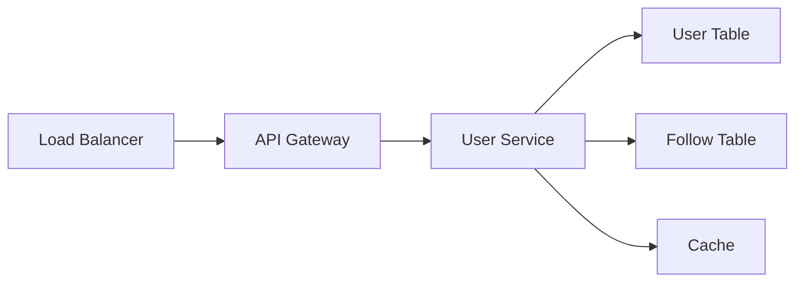

### 12.2 API Endpoints

1. **Create User Account**
    - Endpoint: POST /users
    - Request Body:
      ```json
      {
        "username": "string",
        "email": "string",
        "password": "string"
      }
      ```
    - Response:
      ```json
      {
        "userId": "string",
        "username": "string",
        "email": "string",
        "createdAt": "timestamp"
      }
      ```

2. **Retrieve User Profile**
    - Endpoint: GET /users/{userId}
    - Response:
      ```json
      {
        "userId": "string",
        "username": "string",
        "bio": "string",
        "profilePictureUrl": "string",
        "followerCount": "integer",
        "followingCount": "integer"
      }
      ```

3. **Update User Profile**
    - Endpoint: PUT /users/{userId}
    - Request Body:
      ```json
      {
        "bio": "string",
        "profilePictureUrl": "string",
        "location": "string"
      }
      ```
    - Response: Updated user object

4. **Follow User**
    - Endpoint: POST /users/{userId}/follow
    - Request Body:
      ```json
      {
        "targetUserId": "string"
      }
      ```
    - Response: Success or error message

5. **Unfollow User**
    - Endpoint: DELETE /users/{userId}/follow/{targetUserId}
    - Response: Success or error message

6. **Retrieve Followers**
    - Endpoint: GET /users/{userId}/followers
    - Query Parameters: page, pageSize
    - Response:
      ```json
      {
        "followers": [
          {
            "userId": "string",
            "username": "string",
            "profilePictureUrl": "string"
          }
        ],
        "nextPage": "string"
      }
      ```

7. **Retrieve Following**
    - Endpoint: GET /users/{userId}/following
    - Query Parameters: page, pageSize
    - Response: Similar to followers endpoint

## 12. Designing User Service

### 12.3 Data Storage

User Service will use a relational database (PostgreSQL or MySQL) to store user-related data:

1. **User Table**
   ```sql
   CREATE TABLE users (
     user_id BIGINT PRIMARY KEY AUTO_INCREMENT,
     username VARCHAR(50) UNIQUE NOT NULL,
     email VARCHAR(100) UNIQUE NOT NULL,
     password_hash VARCHAR(255) NOT NULL,
     bio TEXT,
     profile_picture_url VARCHAR(255),
     location VARCHAR(100),
     created_at TIMESTAMP DEFAULT CURRENT_TIMESTAMP,
     INDEX idx_username (username),
     INDEX idx_email (email)
   );
   ```

2. **Follow Table**
   ```sql
   CREATE TABLE follows (
     follower_id BIGINT,
     followee_id BIGINT,
     created_at TIMESTAMP DEFAULT CURRENT_TIMESTAMP,
     PRIMARY KEY (follower_id, followee_id),
     FOREIGN KEY (follower_id) REFERENCES users(user_id),
     FOREIGN KEY (followee_id) REFERENCES users(user_id),
     INDEX idx_follower (follower_id),
     INDEX idx_followee (followee_id)
   );
   ```

## 12. Designing User Service

### 12.4 Key Flows

#### 12.4.1 User Registration Flow

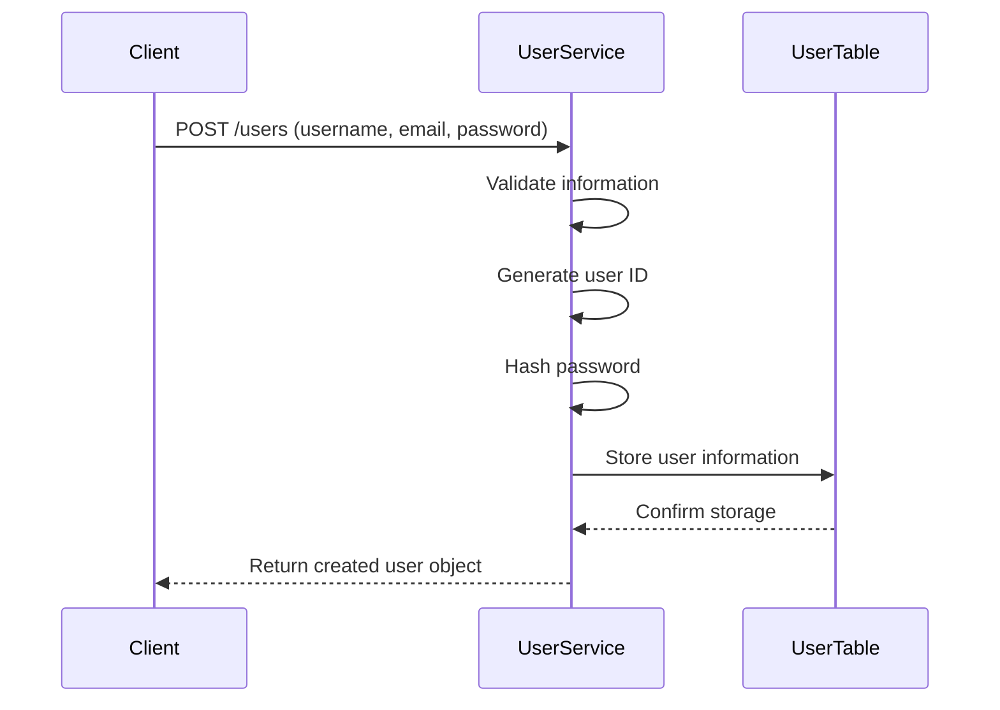

1. Client sends a POST request to `/users` with username, email, and password.
2. User Service validates the input information.
3. User Service generates a unique user ID.
4. User Service hashes the password.
5. User Service stores the user information in the User Table.
6. User Table confirms the storage.
7. User Service returns the created user object to the client.

#### 12.4.2 User Authentication Flow

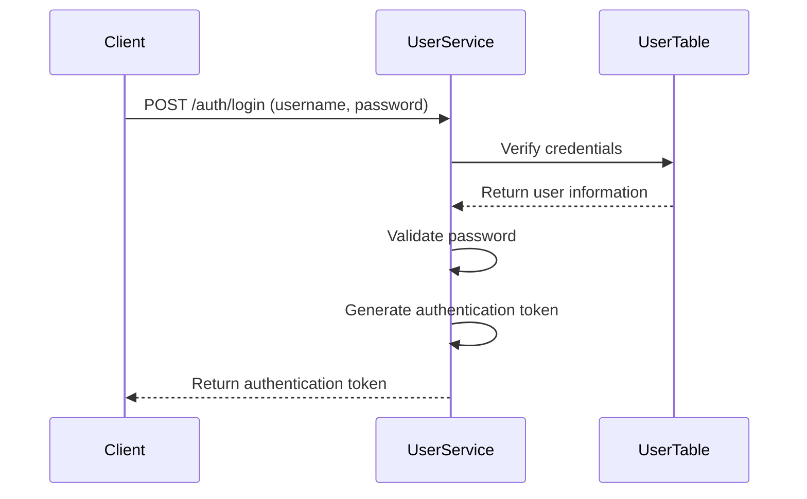

1. Client sends a POST request to `/auth/login` with username and password.
2. User Service verifies the credentials against the User Table.
3. User Table returns the user information.
4. User Service validates the password.
5. User Service generates an authentication token.
6. User Service returns the authentication token to the client.

#### 12.4.3 Follow/Unfollow Flow

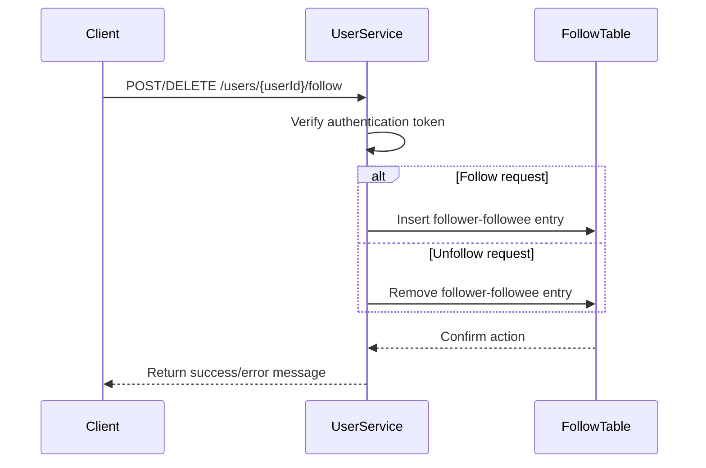

1. Client sends a POST (follow) or DELETE (unfollow) request to `/users/{userId}/follow`.
2. User Service verifies the authentication token.
3. For a follow request, User Service inserts a new follower-followee entry in the Follow Table.
4. For an unfollow request, User Service removes the follower-followee entry from the Follow Table.
5. Follow Table confirms the action.
6. User Service returns a success or error message to the client.

#### 12.4.4 Retrieving Followers/Followees Flow

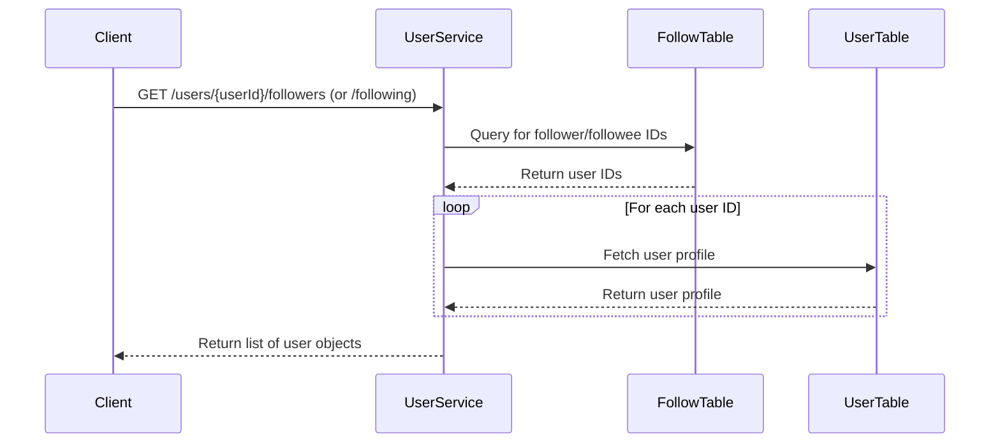

1. Client sends a GET request to `/users/{userId}/followers` or `/users/{userId}/following`.
2. User Service queries the Follow Table for follower or followee IDs.
3. Follow Table returns the relevant user IDs.
4. For each user ID, User Service fetches the user profile from the User Table.
5. User Service compiles a list of user objects.
6. User Service returns the list of user objects to the client.

### 12.5 Optimization Strategies

1. **Indexing**: Ensure proper indexing on frequently queried columns (e.g., username, email in the `users` table).
2. **Caching**: Implement a caching layer (e.g., Redis) for frequently accessed user profiles and follower/following lists.
3. **Connection Pooling**: Use database connection pooling to efficiently manage database connections.
4. **Pagination**: Implement cursor-based pagination for large result sets (e.g., followers/following lists).
5. **Asynchronous Processing**: Use message queues for non-critical updates (e.g., updating follower counts) to improve response times.

## 13. Designing Timeline Service

Timeline Service is responsible for generating and serving user timelines in the Twitter-like service. It aggregates tweets from the users a person follows and presents them in chronological order.

### 13.1 API Endpoints

1. **GET /timeline/{userId}** – retrieve the user's home timeline:
    - Request: User authentication token
    - Response: List of tweet objects representing the user's timeline

2. **GET /timeline/{userId}/mentions** – retrieve the user's mentions timeline:
    - Request: User authentication token
    - Response: List of tweet objects mentioning the user

### 13.2 Data Flow

Timeline Service relies on Tweet Service and User Service to generate user timelines.

#### 13.2.1 Creating a New Tweet

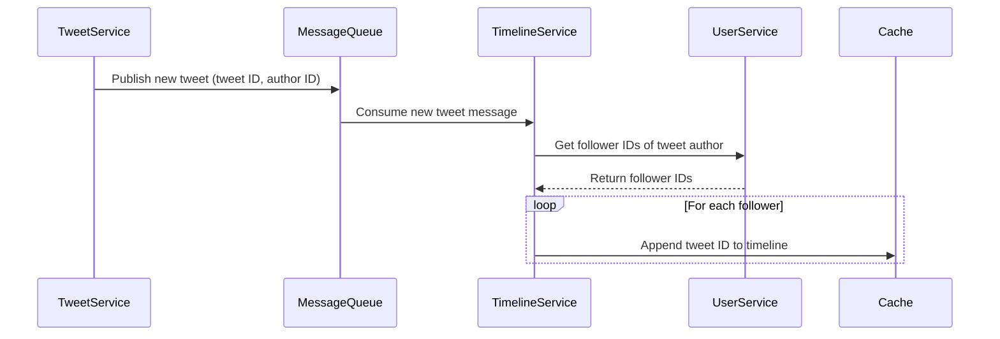

1. When a new tweet is created, Tweet Service publishes a message to the message queue (e.g., Apache Kafka) containing the tweet ID and the user ID of the tweet author.
2. Timeline Service consumes the message from the message queue.
3. Timeline Service retrieves the follower IDs of the tweet author from User Service.
4. For each follower, Timeline Service appends the tweet ID to their timeline data structure (e.g., a list or a sorted set) stored in the cache (e.g., Redis).
5. The timeline data structure maintains a limited number of recent tweet IDs for each user, typically based on a time window or a maximum count.

#### 13.2.2 Timeline Retrieval Flow

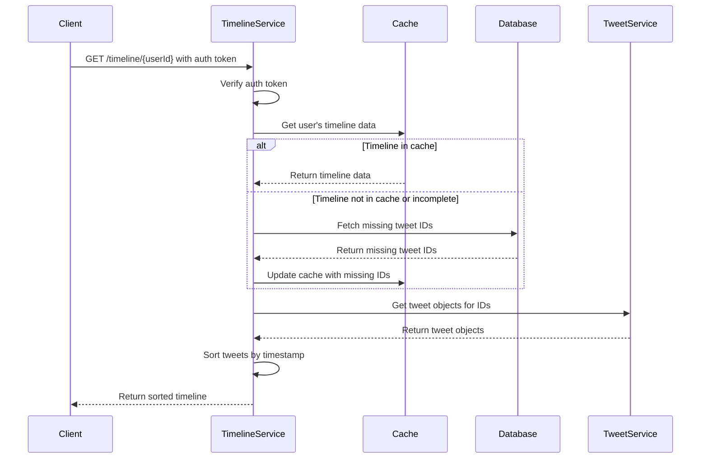

When a user requests their home timeline, the following occurs:

1. The client sends a GET request to the /timeline/{userId} endpoint with the user authentication token.
2. Timeline Service verifies the authentication token to ensure the request is made by a valid user.
3. Timeline Service retrieves the user's timeline data structure from the cache.
4. If the timeline data structure is not found in the cache or is incomplete, Timeline Service fetches the missing tweet IDs from the database and updates the cache accordingly.
5. Timeline Service retrieves the actual tweet objects corresponding to the tweet IDs from Tweet Service.
6. The retrieved tweets are sorted based on their timestamps to ensure chronological order.
7. The sorted list of tweet objects is returned to the client as the user's home timeline.

## 13. Designing Timeline Service

[Previous sections 13.1 and 13.2 remain unchanged]

### 13.3 Mentions Timeline

The mentions timeline is generated similarly to the home timeline but with a different data flow.

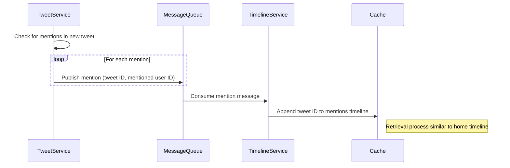

1. When a new tweet is created, Tweet Service checks whether the tweet contains any mentions of other users.
2. If mentions are found, Tweet Service publishes a separate message to the message queue for each mentioned user, containing the tweet ID and the mentioned user ID.
3. Timeline Service consumes these messages and appends the tweet ID to the mentions timeline data structure of each mentioned user in the cache.
4. The mentions timeline retrieval process is similar to the home timeline retrieval, but uses the mentions timeline data structure instead.

### 13.4 Push-based Updates

To provide real-time updates to user timelines, Timeline Service can utilize push-based mechanisms:

1. When a new tweet is created, Timeline Service sends a real-time notification to the relevant users' clients using WebSocket connections.
2. The clients can update their timelines instantly upon receiving the notification, providing a real-time user experience.

### 13.5 Conclusion

By following this low-level design, Timeline Service can efficiently generate and serve user timelines by aggregating tweets from followed users. It leverages caching and push-based updates to provide a real-time and responsive user experience. The service integrates with Tweet Service, User Service, and the message queue to ensure data consistency and scalability.


## 14. Designing Search Service

Search Service is responsible for enabling users to search for tweets and user profiles based on keywords, hashtags, and other criteria in the Twitter-like service. It provides powerful and efficient search functionality to help users discover relevant content.

### 14.1 High-Level Architecture

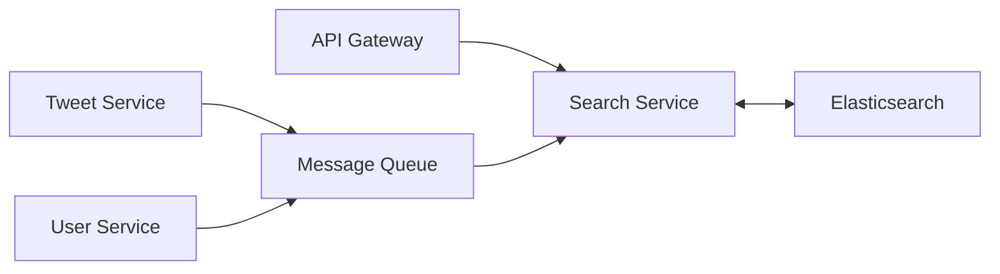

### 14.2 API Endpoints

1. **GET /search/tweets**
    - Purpose: Search for tweets based on a given query
    - Parameters:
        - q: Search query
        - limit: Optional, for pagination
        - offset: Optional, for pagination
    - Response: List of tweet objects matching the search query

2. **GET /search/users**
    - Purpose: Search for user profiles based on a given query
    - Parameters:
        - q: Search query
        - limit: Optional, for pagination
        - offset: Optional, for pagination
    - Response: List of user objects matching the search query

### 14.3 Data Flow and Indexing

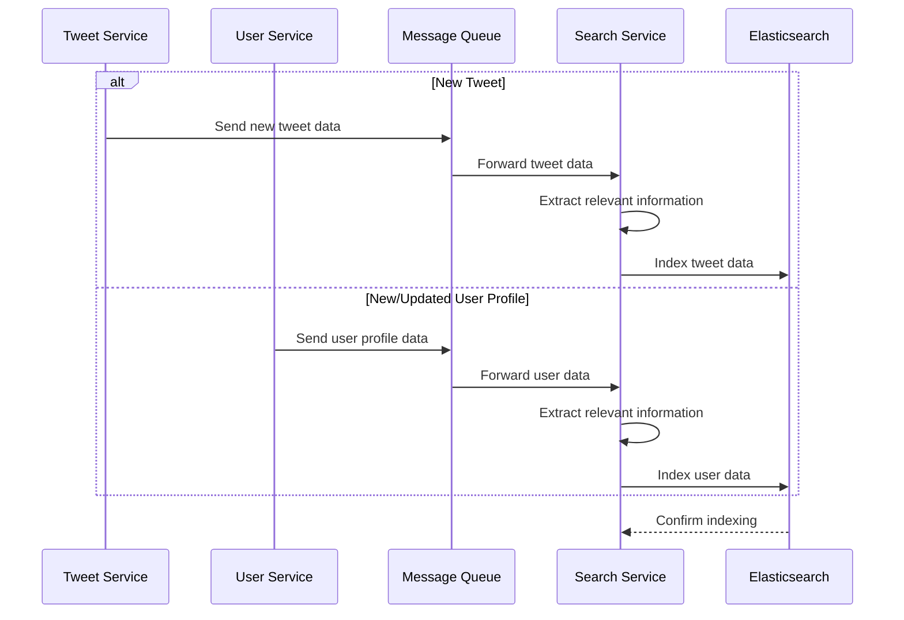

1. When a new tweet is created, Tweet Service sends the tweet data to the Message Queue.
2. Search Service consumes the message and extracts relevant information from the tweet (text content, hashtags, mentions, user details).
3. The extracted data is indexed in Elasticsearch, creating an inverted index mapping terms to tweet IDs.
4. For new users or profile updates, User Service sends the user data to the Message Queue.
5. Search Service consumes the message and indexes the user data (username, bio, location) in Elasticsearch.

### 14.4 Search Query Processing

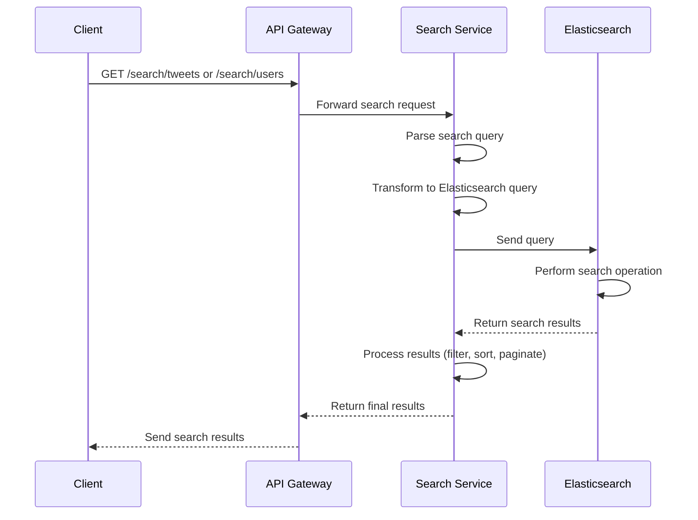

1. The client sends a GET request to `/search/tweets` or `/search/users` with the search query and optional pagination parameters.
2. Search Service receives the request and parses the search query.
3. The parsed query is transformed into an Elasticsearch query using appropriate query builders and filters.
4. Search Service sends the query to Elasticsearch, which performs the search operation on the indexed data.
5. Elasticsearch retrieves the matching tweet or user documents based on the query criteria.
6. Search Service processes the search results, applying any additional filtering, sorting, or pagination as needed.
7. The final list of tweets or user objects is returned to the client as the search results.

By implementing this design, Search Service can efficiently index and search tweets and user profiles, providing fast and relevant search results to users of the Twitter-like platform.

### 14.5 Relevance Scoring and Ranking

To provide the most relevant search results, Search Service utilizes Elasticsearch's relevance scoring and ranking capabilities.

1. **TF-IDF (Term Frequency-Inverse Document Frequency)**
    - Term Frequency: How often a term appears in a document
    - Inverse Document Frequency: How rare a term is across all documents
    - Elasticsearch uses TF-IDF to calculate the basic relevance score

2. **Field-level Boosting**
    - Certain fields can be given more importance in the relevance calculation
    - Example: Boosting the 'username' field for user searches

3. **Custom Scoring Functions**
    - Implement custom scoring logic based on specific requirements
    - Example: Boosting tweets with more likes or retweets

```python
# Example Elasticsearch query with custom scoring
{
  "query": {
    "function_score": {
      "query": {
        "multi_match": {
          "query": "search_term",
          "fields": ["content^3", "username^2", "hashtags"]
        }
      },
      "functions": [
        {
          "field_value_factor": {
            "field": "likes",
            "factor": 1.2,
            "modifier": "log1p"
          }
        },
        {
          "field_value_factor": {
            "field": "retweets",
            "factor": 1.5,
            "modifier": "log1p"
          }
        }
      ],
      "boost_mode": "sum"
    }
  }
}
```

This example query boosts the 'content' field, includes a custom scoring based on likes and retweets, and combines these scores to determine the final relevance ranking.

## 15. Additional Considerations

### 15.1 Handling Trending Topics and Hashtags

1. **Real-time Processing**
    - Utilize stream processing frameworks (e.g., Apache Storm, Apache Flink)
    - Analyze incoming tweet data in real-time

2. **Trend Identification Algorithm**
    - Implement a sliding window algorithm to track topic/hashtag frequency
    - Consider factors like tweet volume, user diversity, and time decay

3. **Storage and Caching**
    - Store trending data in a distributed cache (e.g., Redis)
    - Update trends periodically (e.g., every 5 minutes)

4. **API Endpoint**
    - Provide a `/trending` endpoint to retrieve current trending topics
    - Allow filtering by geographic location or user demographics

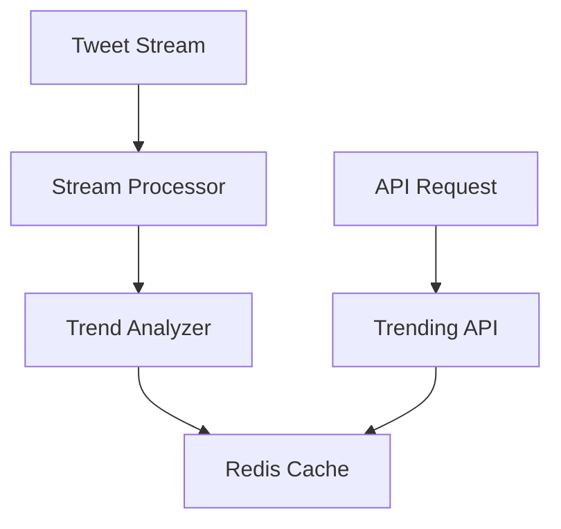

### 15.2 Implementing Rate Limiting and Throttling

1. **Rate Limit Definition**
    - Set appropriate limits for different API endpoints
    - Example: 100 requests per minute for regular users, 1000 for verified users

2. **Token Bucket Algorithm**
    - Implement a token bucket for each user or API key
    - Refill tokens at a fixed rate
    - Allow requests if tokens are available, otherwise reject

3. **Distributed Rate Limiting**
    - Use a distributed cache (e.g., Redis) to store rate limit data
    - Ensure consistency across multiple API gateway instances

4. **Response Headers**
    - Include rate limit information in response headers:
        - `X-RateLimit-Limit`: Total allowed requests
        - `X-RateLimit-Remaining`: Remaining requests in the current window
        - `X-RateLimit-Reset`: Time when the limit resets

5. **Graceful Degradation**
    - Implement retry mechanisms with exponential backoff for rate-limited clients
    - Provide clear error messages when rate limits are exceeded

```python
# Pseudocode for rate limiting middleware
def rate_limit_middleware(request):
    user_id = get_user_id(request)
    bucket = get_token_bucket(user_id)
    
    if bucket.consume(1):
        return process_request(request)
    else:
        return rate_limit_exceeded_response()
```

By implementing these additional considerations, the Twitter-like service can handle trending topics effectively and protect itself from abuse through rate limiting, ensuring a robust and fair system for all users.


## 16. System Design Summary

This summary provides a quick overview of the key components and considerations in our Twitter-like service design.

### 16.1 Core Services

1. **Tweet Service**
    - Handles tweet creation, retrieval, and deletion
    - Stores tweet data in the database and media in object storage
    - Publishes new tweets to the message queue for other services

2. **User Service**
    - Manages user registration, authentication, and profile information
    - Handles follow/unfollow functionality
    - Stores user data and relationships

3. **Timeline Service**
    - Generates and serves user timelines
    - Consumes new tweets from the message queue
    - Implements efficient timeline generation and caching strategies

4. **Search Service**
    - Enables full-text search for tweets and users
    - Utilizes Elasticsearch for indexing and searching
    - Implements relevance scoring and ranking

### 16.2 Data Storage and Caching

1. **Databases**
    - Relational database (e.g., PostgreSQL) for structured data
    - Distributed database (e.g., Cassandra) for high write throughput

2. **Object Storage**
    - For storing media files (e.g., Amazon S3)

3. **Caching**
    - Distributed caching (e.g., Redis) for frequently accessed data
    - Multi-level caching strategies (L1, L2 caches)

4. **Message Queue**
    - For asynchronous communication between services (e.g., Apache Kafka)

### 16.3 Scalability and Performance

1. **Load Balancing**
    - Distribute incoming traffic across multiple server instances

2. **Microservices Architecture**
    - Allows independent scaling of different components

3. **Database Sharding**
    - Horizontal partitioning of data for better performance

4. **Read Replicas**
    - For handling high read traffic

5. **Caching Strategies**
    - Various caching techniques to reduce database load

6. **Asynchronous Processing**
    - Use of message queues for non-blocking operations

### 16.4 Search and Indexing

1. **Elasticsearch**
    - For efficient full-text search and indexing

2. **Relevance Scoring**
    - TF-IDF, field-level boosting, custom scoring functions

3. **Real-time Indexing**
    - Immediate indexing of new tweets and user profiles

### 16.5 API Design

1. **RESTful APIs**
    - Well-defined endpoints for each service

2. **API Gateway**
    - Single entry point for all client requests
    - Handles authentication, rate limiting, and request routing

3. **Pagination**
    - For large result sets (e.g., timelines, search results)

### 16.6 Real-time Features

1. **WebSocket Connections**
    - For real-time updates (e.g., new tweets, notifications)

2. **Trending Topics**
    - Real-time processing of tweet stream
    - Use of stream processing frameworks (e.g., Apache Storm)

### 16.7 Security and System Protection

1. **Authentication and Authorization**
    - Secure user authentication (e.g., OAuth 2.0)
    - Role-based access control

2. **Rate Limiting and Throttling**
    - Protect system from abuse and ensure fair usage

3. **Data Encryption**
    - For sensitive data in transit and at rest

### 16.8 Monitoring and Logging

1. **Distributed Tracing**
    - For request flows across microservices

2. **Metrics Collection**
    - Monitor system health and performance

3. **Centralized Logging**
    - For easier debugging and issue resolution

### 16.9 Fault Tolerance and Reliability

1. **Service Redundancy**
    - Multiple instances of each service

2. **Data Replication**
    - For databases and caches

3. **Circuit Breakers**
    - To prevent cascading failures

4. **Eventual Consistency**
    - For distributed data stores

This summary encapsulates the key system design topics incorporated in our Twitter-like service, providing a comprehensive overview of the architecture, components, and considerations that went into the design.